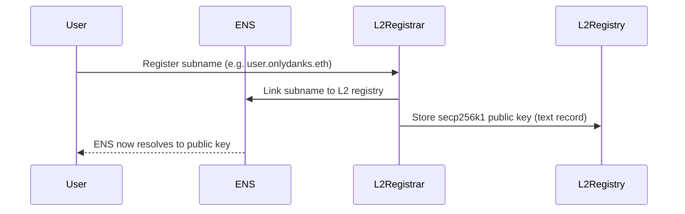
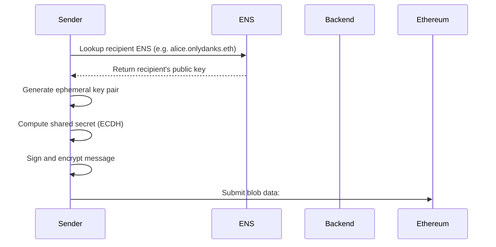
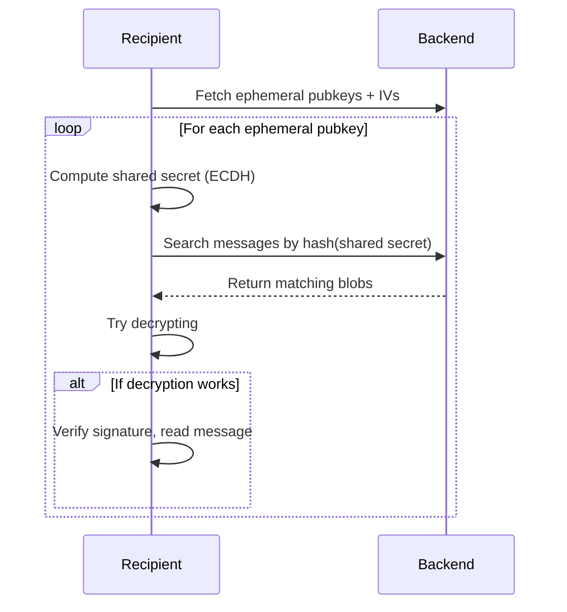

<div align="center">
	
  <h1>OnlyDanks</h1>
	<p align="center">
    <a href="https://ethglobal.com/showcase/onlydanks-wi77b">ETHGlobal Showcase</a>
		<br/>
		<a href="#about">About This Project</a>
		·
		<a href="#how-it-works-conceptually">How It Works</a>
  	</p>
	<br/>
</div>

<div align="center">
  
</div>

<br/>

# About
Private end-to-end encrypted messenger built on blobs, fully anonymous and censorship-resistant.

## Description

### What Is It?

OnlyDanks is a messaging system that lives entirely on the Ethereum blockchain. There are no apps, no servers, and no middlemen. Messages are written directly to Ethereum’s new **blob** storage, making them:
- **Invisible to third parties** (no one can read them),
- **Unlinkable** (no one can tell who’s talking to whom),
- **Censorship-resistant** (no one can delete or block them).

It works like a **fully private postbox**, where only the intended recipient has the key—and no one even knows the box exists.

### How It Works (Conceptually)

- You create a **public identity** using an Ethereum Name like `yourname.onlydanks.eth`.
- This name links to a **public key**, like sharing your digital mailbox.
- When someone wants to message you:
  - They use your public key to encrypt a message.
  - They publish it into Ethereum’s blob space.
- You periodically check for new messages by scanning the blockchain.
- If a message is meant for you, you can **decrypt and read it**.

### Why It's Special

- **Privacy by design**: No servers or apps know who you are.
- **Stealthy delivery**: Only you can find and read your messages.
- **Globally accessible**: Anyone with an Ethereum wallet can use it.
- **No central control**: Can't be taken down, blocked, or censored.
- **No history or tracking**: All data is ephemeral and unlinkable.


## Technical

### Identity & Registration

- Users register ENS subnames (e.g., `user.onlydanks.eth`) through an L2 registrar on **World-Seoplia**.
- Each subname links to a **secp256k1 public key** via ENS text record.
- ENS’s L1 resolver points to our L2 registry.

### Message Sending Flow

1. **Look up ENS subname** → get public key.
2. **Generate ephemeral private key**.
3. Use **ECDH** (Diffie-Hellman) to create shared secret.
4. **Sign the message** with sender's private key.
5. **Encrypt** the signed message with the shared secret.
6. Publish to blob:
   - Ephemeral public key
   - Initialization vector (IV)
   - `hash(shared_secret)` (used for message lookup)
   - Encrypted message

### Backend Service
- Stateless, self-hostable.
- Indexes blobs and provides:
  - List of `ephemeral public keys + IV`
  - Messages by `hash(shared_secret)`
- Does **not store any private info** or user data.

### Message Receiving Flow

- The recipient downloads **ephemeral public keys + IVs** from the backend.
- Tries to compute shared secrets from each.
- For each derived `hash(shared_secret)`, queries backend for matching blobs.
- If found, decrypts the message and verifies the sender via signature.

### Deployed Contracts
**WorldChain**
```
ENS Registry:	0xc3a4eb979e9035486b54fe8b57d36aef9519eac6
ENS Registrar:	0x491c7b1319A0c683027ae2A2A7b7c34913A6178e
```

**WorldChain Sepolia**
```
ENS Registry:	0x41Fb196Ae7D65E06880A240c8d1B91245Fb84807
ENS Registrar:	0x1468386e6ABb1874c0d9fD43899EbD21A12470A6
```
